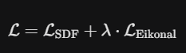
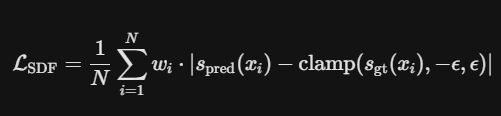
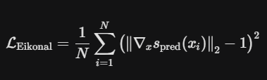

# 🫁 Tái tạo 3D Khối u Phổi LIDC-IDRI sử dụng Neural ODE


## 📖 Tổng Quan (Overview)

Dự án này triển khai một khung mô hình tiên tiến (SOTA) **End-to-End Implicit Neural ODE** để tái tạo lưới bề mặt 3D (Mesh) chất lượng cao của các khối u phổi từ tập dữ liệu LIDC-IDRI.

Khác với các phương pháp phân đoạn truyền thống (voxel-based) hay biến dạng lưới mẫu (template deformation), mô hình này coi hình dạng khối u là một quá trình **biến đổi liên tục dọc theo trục Z (độ sâu)**. Hệ thống bao gồm:

* **Encoder:** Sử dụng kiến trúc **3D nnU-Net** (thư viện MONAI) để trích xuất đặc trưng không gian từ các lát cắt CT thưa thớt.
* **Latent Dynamics:** Sử dụng bộ giải **Neural ODE Solver** (`torchdiffeq`) để mô hình hóa sự biến đổi hình dạng liên tục và nội suy các chi tiết giải phẫu bị thiếu giữa các lát cắt.
* **Decoder:** Một mạng **Implicit MLP** dự đoán hàm khoảng cách có dấu (Signed Distance Function - SDF) tại bất kỳ tọa độ 3D nào.

Phương pháp này giải quyết hiệu quả vấn đề **độ phân giải không đồng nhất** (anisotropic resolution) thường gặp trong ảnh y tế.

---

## 📂 Cấu trúc Dự án (Project Structure)
```bash
LIDC_Lung_Tumor_NeuralODE/
│
├── 📄 .pylidcrc                  # File cấu hình đường dẫn cho thư viện pylidc (BẮT BUỘC)
├── 📄 requirements.txt           # Danh sách các thư viện cần cài đặt (PyTorch, MONAI, Pylidc...)
├── 📄 README.md                  # Tài liệu hướng dẫn sử dụng dự án
│
├── 📁 configs/                   # Cấu hình tham số toàn cục (Hyperparameters)
│   └── config.yaml               # Chỉnh sửa learning rate, batch size, đường dẫn, tham số model...
│
├── 📁 data/                      # QUẢN LÝ DỮ LIỆU
│   ├── 📂 raw/                   # Dữ liệu thô (Immutable)
│   │   └── LIDC-IDRI/            # Thư mục chứa các file DICOM giải nén từ dataset gốc
│   │
│   └── 📂 processed/             # Dữ liệu sau khi tiền xử lý (Sẵn sàng cho Training)
│       ├── 📂 rois/              # Các khối 3D ROI (64x64x32) đã cắt và chuẩn hóa (.npy)
│       ├── 📂 sdfs/              # Dữ liệu điểm mẫu (x,y,z) và giá trị SDF tương ứng (.npz)
│       ├── 📂 meshes_gt/         # Mesh Ground Truth (.obj) dùng để đánh giá
│       └── split_data.json       # File phân chia tập dữ liệu: Train / Validation / Test
│
├── 📁 src/                       # MÃ NGUỒN CHÍNH (Source Code)
│   ├── __init__.py
│   │
│   ├── 📂 data/                  # Module: Xử lý dữ liệu (Data Pipeline)
│   │   ├── __init__.py
│   │   ├── dicom_loader.py       # Wrapper cho pylidc để load scan và annotation
│   │   ├── preprocessing.py      # Các hàm Resample, Crop ROI, Consensus Masking
│   │   ├── generation.py         # Các hàm tạo Point Cloud và tính toán SDF
│   │   └── dataset_loader.py     # Class CustomDataset phục vụ PyTorch DataLoader
│   │
│   ├── 📂 models/                # Module: Kiến trúc mạng (Neural ODE Architecture)
│   │   ├── __init__.py
│   │   ├── encoders.py           # 3D Encoder (Sử dụng MONAI nnU-Net backbone)
│   │   ├── ode_func.py           # Hàm vi phân f(z,t) cho Neural ODE Solver
│   │   ├── decoders.py           # Implicit Decoder (MLP dự đoán giá trị SDF)
│   │   └── full_model.py         # Class ghép nối toàn bộ: Encoder -> ODE -> Decoder
│   │
│   ├── 📂 training/              # Module: Huấn luyện
│   │   ├── __init__.py
│   │   ├── losses.py             # Các hàm Loss: SDF L1 Loss, Eikonal Loss
│   │   └── trainer.py            # Vòng lặp huấn luyện (Forward, Backward, Validation Loop)
│   │
│   └── 📂 utils/                 # Module: Tiện ích bổ trợ
│       ├── __init__.py
│       ├── marching_cubes.py     # Thuật toán trích xuất bề mặt 3D từ trường SDF (Inference)
│       ├── metrics.py            # Tính toán chỉ số đánh giá: Chamfer Distance, Hausdorff Distance
│       └── visualizer.py         # Vẽ biểu đồ Loss, hiển thị lát cắt CT
│
├── 📁 experiments/               # LOGS & CHECKPOINTS (Lưu kết quả chạy)
│   └── 📂 exp_01_unet/         # Thí nghiệm chính sử dụng nnU-Net
│       ├── 📂 checkpoints/       # Lưu trọng số mô hình tốt nhất (.pth)
│       ├── 📂 logs/              # File log để theo dõi trên TensorBoard
│       └── 📂 visuals/           # Ảnh kết quả dự đoán được lưu tự động khi train
│
├── 📁 outputs/                   # KẾT QUẢ ĐẦU RA (Final Results)
│   ├── 📂 predictions/           # Các file .obj tái tạo từ tập Test (Dùng để xem trên Blender)
│   └── 📄 evaluation_report.csv  # Bảng báo cáo định lượng các chỉ số (Metric Report)
│
├── 📁 notebooks/                 # JUPYTER NOTEBOOKS (Nháp & Kiểm thử)
│   ├── data_exploration.ipynb    # Kiểm tra, trực quan hóa dữ liệu pylidc
│   ├── test_model.ipynb          # Chạy thử luồng model (Debug kích thước tensor)
│   └── visualization.ipynb       # Vẽ hình ảnh đẹp để đưa vào báo cáo/paper
│
├── 🐍 prepare_data.py            # [Bước 1] Script chạy tiền xử lý dữ liệu
├── 🐍 train_model.py             # [Bước 2] Script chạy huấn luyện mô hình
└── 🐍 inference_eval.py          # [Bước 3] Script chạy tái tạo 3D và đánh giá kết quả
```
---

# ⚙️ Cài đặt (Installation)
1. Yêu cầu hệ thống
Python 3.10+

GPU hỗ trợ CUDA (Khuyến nghị: 12GB+ VRAM để chạy nnU-Net Encoder).

Dataset LIDC-IDRI: Tải về và giải nén vào thư mục data/raw/LIDC-IDRI/.

2. Cài đặt thư viện 

Nếu dùng colab, tạo local server trên conda để chạy colab
```bash
    conda create -n colab_local python=3.10 jupyter jupyterlab -y
    conda activate colab_local
    pip install jupyter_http_over_ws
    jupyter serverextension enable --py jupyter_http_over_ws
    jupyter notebook --NotebookApp.allow_origin='https://colab.research.google.com' --port=8888 --no-browser --NotebookApp.port_retries=0
```
Nếu dùng conda:
```bash
    # Tạo env tên lidc-neuralode, dùng python 3.9 hoặc 3.10 (thường ổn định nhất cho NeuralODE cũ)
    conda create -n lidc-neuralode python=3.10 -y
    conda activate lidc-neuralode
    
    # Install pytorch đúng phiên bản trước (theo cuda của máy)
    # Ví dụ máy có CUDA 11.8
    conda install pytorch torchvision torchaudio pytorch-cuda=11.8 -c pytorch -c nvidia
    
    # Sau đó mới install cái requirements.txt
    pip install -r requirements.txt
```
Nếu dùng cmd như bình thường thì dùng venv, cài đặt các thư viện cần thiết
```bash
    python -m venv venv
  # 2. Kích hoạt env
    .\venv\Scripts\Activate
    
    # 3. Upgrade pip trong env
    python -m pip install --upgrade pip
    
    # 4. Install requirements
    pip install -r requirements.txt
```
Nếu không thích hợp GPU thì: 
```bash
    pip install --pre torch torchvision --index-url https://download.pytorch.org/whl/nightly/cu128
    # Chạy test xem nó ổn không
    python -c "import torch; print(torch.rand(2,2).cuda())"
```
3. Cấu hình
Dự án sử dụng cơ chế "God Mode Loader" để tự động tìm đường dẫn dữ liệu. Tuy nhiên, hãy kiểm tra file configs/config.yaml để đảm bảo các tham số roi_size (kích thước cắt) và sdf_samples (số điểm mẫu) phù hợp với phần cứng.

# 🚀 Quy trình Thực hiện (Workflow)

## Bước 1: Tiền xử lý dữ liệu (Preprocessing)
1. Nạp dữ liệu & Gộp nhãn (Consensus)
- Vấn đề: Trong bộ dữ liệu LIDC-IDRI, mỗi nodule được đánh dấu bởi tối đa 4 bác sĩ chẩn đoán hình ảnh. Mỗi người vẽ một đường viền khác nhau.
- Chúng ta cần tạo ra một Ground Truth để máy học.
- Kỹ thuật: Majority Voting - bỏ phiếu đa số - 50%.
- Cách thực hiện:Chồng 4 mask của 4 bác sĩ lên nhau. Một voxel chỉ được coi là "Khối u" nếu có ít nhất 2 trên 4 bác sĩ đồng ý.Nếu chỉ có 1 người khoanh vùng đó -> Coi là nhiễu, bỏ qua.
- => Cách này giúp loại bỏ các sai sót cá nhân của từng bác sĩ và tạo ra một mask có độ tin cậy cao nhất.
2. Đồng nhất độ phân giả
- Vấn đề: Ảnh CT là tập hợp các lát cắt 2D xếp chồng lên nhau.
- Độ phân giải trên mặt lát cắt trục X, Y rất nét: thường là 0.5mm - 0.7mm.
- Nhưng khoảng cách giữa các lát cắt trục Z thường rất dày: 2.0mm - 3.0mm.
- Nếu để nguyên, khối u hình cầu sẽ bị máy tính nhìn thành hình dẹt vì trục Z bị nén.
- => Đưa tất cả về cùng một độ phân giải chuẩn $1mm \times 1mm \times 1mm$.
- Kỹ thuật: Interpolation.
+ Với ảnh CT: Dùng Spline Interpolation bậc 1  để giữ độ mượt.
+ Với Mask: Dùng Nearest Neighbor (bậc 0) để đảm bảo mask vẫn chỉ là 0 và 1, không bị ra số thập phân mờ nhòe.
3. Intensity Normalization
- Máy chụp CT đo độ đậm đặc của vật chất bằng đơn vị Hounsfield Unit (HU).
+ Khí: -1000 HU
+ Nước: 0 HU
+ Xương: +1000 HU
+ Giá trị này quá lớn để đưa vào Mạng Nơ-ron (thường thích số từ 0 đến 1).
- Bước 1 (Clipping): Chỉ quan tâm đến Lung Window. Ta cắt bỏ mọi giá trị nằm ngoài khoảng $[-1000, 400]$.
+ Dưới -1000 (khí ngoài cơ thể): Gán thành -1000.
+ Trên 400 (xương): Gán thành 400.
- Bước 2 (Scaling): Co giãn khoảng $[-1000, 400]$ về đoạn $[0, 1]$.
4. ROI Cropping
- Phổi rất to ($512 \times 512 \times \text{Depth}$), nhưng khối u chỉ bé tẹo (khoảng 10-30mm). Nếu đưa cả phổi vào, mô hình sẽ bị loãng thông tin.
Giờ:
+ Tìm tâm của khối u (từ bước Consensus).
+ Cắt một khối hộp kích thước cố định $64 \times 64 \times 32$ bao quanh tâm đó.
+ Padding: Nếu khối u nằm sát rìa phổi, ta bù thêm các pixel có giá trị 0 (màu đen) để đảm bảo kích thước đầu vào luôn cố định.
5. SDF Generation
Dùng cho mô hình Implicit Neural ODE, nếu dùng mô hình khác có thể tham khảo. Mô hình này không học từ ảnh Mask, mà học từ các Điểm trong không gian.
- Input: Mask 3D của khối u.
- Bước 1: Dùng thuật toán Marching Cubes để chuyển Mask voxel thành Mesh.
- Bước 2: Sinh ra 10.000 điểm $(x, y, z)$.
+ 80% điểm: Nằm ngay trên bề mặt hoặc cực sát bề mặt khối u để mô hình học kỹ biên dạng.
+ 20% điểm: Nằm ngẫu nhiên trong hộp ROI để mô hình biết đâu là nền/background.
- Bước 3 (Tính SDF): Với mỗi điểm, tính khoảng cách ngắn nhất từ nó đến bề mặt Mesh.
+ Điểm bên trong u: Giá trị Âm (-).
+ Điểm bên ngoài u: Giá trị Dương (+).
+ Scale: Chia giá trị này cho 20.0 để mạng dễ học.

```bash
    rmdir /s /q data\processed # Neu duoc tao tu truoc
    python prepare_data.py
```
Kết quả: Các file .npy và .npz được tạo trong data/processed/.

## Bước 2: Huấn luyện Mô hình (Training)
- Hàm loss:
Tổng hàm Loss $\mathcal{L}$ là sự kết hợp giữa SDF Reconstruction Loss để tạo hình dáng và Eikonal Loss để làm mịn bề mặt:



Trong đó hệ số $\lambda = 0.005$

1. Weighted SDF L1 Loss
Đây là thành phần chính giúp mô hình học được hình dạng khối u. Sử dụng L1 Loss có trọng số và kẹp giá trị.



Giải thích:
- $N$: Số lượng điểm mẫu (batch size $\times$ số điểm).
- $x_i$: Tọa độ điểm 3D $(z, y, x)$.
- $s_{\text{pred}}(x_i)$: Giá trị SDF do mô hình dự đoán.
- $s_{\text{gt}}(x_i)$: Giá trị SDF thực tế (Ground Truth).
- Hàm $\text{clamp}(v, -\epsilon, \epsilon)$: Kẹp giá trị Ground Truth trong khoảng nhỏ ($[-0.5, 0.5]$) để mô hình tập trung học kỹ vùng bề mặt, bỏ qua sai số ở vùng xa.
- $w_i$ (Trọng số): Phạt nặng nếu đoán sai vùng bên trong khối u.

$$w_i = \begin{cases} 15.0 & \text{nếu } s_{\text{gt}}(x_i) < 0 \text{ (Bên trong u)};
\\ 1.0 & \text{nếu } s_{\text{gt}}(x_i) \ge 0 \text{ (Bên ngoài u)} \end{cases}$$

2. Eikonal Regularization
Đây là thành phần phụ trợ giúp bề mặt trơn mượt và đúng tính chất vật lý. Theo định nghĩa toán học, độ lớn gradient của một hàm khoảng cách (SDF) tại bất kỳ đâu phải luôn bằng 1.



Giải thích:
- $\nabla_{x} s_{\text{pred}}$: Đạo hàm (Gradient) của giá trị dự đoán theo tọa độ không gian $(x, y, z)$.
- Nó ép mô hình: Đừng thay đổi giá trị quá gắt, cũng đừng thay đổi quá chậm, hãy thay đổi đều đặn với tốc độ bằng 1.


Huấn luyện mạng Neural ODE. Script hỗ trợ Mixed-precision training (AMP) để tăng tốc độ và TensorBoard để theo dõi Loss.

```bash
  rmdir /s /q experiments\exp_02_resnet
  python train_model.py --config configs/config.yaml
  python train_model.py --config configs/config.yaml --resume experiments/exp_01_unet/checkpoints/last.pth
  python train_model.py --config configs/config.yaml --resume experiments/exp_02_resnet/checkpoints/last.pth
```
Kết quả: File trọng số model tốt nhất được lưu tại experiments/exp_01_unet/checkpoints/.

## Bước 3: Suy luận & Đánh giá (Inference & Evaluation)
Tái tạo Mesh 3D từ tập dữ liệu kiểm tra (Test set) và tính toán các chỉ số sai số hình học (Chamfer Distance, Hausdorff Distance).

```bash
# Chạy với checkpoint tốt nhất
python inference_eval.py --checkpoint experiments/exp_01_unet/checkpoints/best_model.pth
python inference_eval.py --checkpoint experiments/exp_02_resnet/checkpoints/best_model.pth
```
# 📊 Kết quả & Trực quan hóa
Theo dõi quá trình Train
Mở TensorBoard để xem biểu đồ Loss và Eikonal regularization theo thời gian thực:
```bash
tensorboard --logdir experiments/exp_01_unet/logs
tensorboard --logdir experiments/exp_02_resnet/logs
```
# Xem mô hình 3D
Các file đầu ra .obj đã được căn giữa (centered) và đúng tỷ lệ. Để xem:

Mở phần mềm Blender.

Import file Wavefront (.obj).

Tác giả: Tuấn Anh, HCMUT